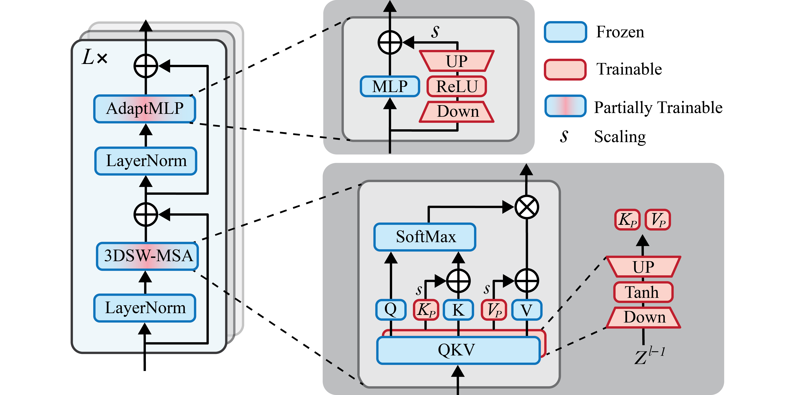

<div align="center">

## V-PETL:  A Unified View of Visual PETL Techniques


</div>

This is a PyTorch implementation of the paper [Towards a Unified View on Visual Parameter-Efficient Transfer Learning](http://arxiv.org/abs/2210.00788)

[Bruce X.B. Yu](https://bruceyo.github.io/)<sup>1</sup>,
[Jianlong Chang](https://scholar.google.com/citations?user=RDwnNsQAAAAJ)<sup>2</sup>,
[Lingbo Liu](https://lingboliu.com/)<sup>1</sup>,
[Qi Tian](https://scholar.google.com/citations?user=61b6eYkAAAAJ)<sup>2</sup>,
[Chang Wen Chen](https://chenlab.comp.polyu.edu.hk/)<sup>1</sup>\*

<sup>1</sup>The Hong Kong Polytechnic University, <sup>2</sup>Huawei Inc.

\*denotes the corresponding author

### Usage

#### Install
* Geforce 3090 (24G): CUDA 11.4+, PyTorch 1.13.0 + torchvision 0.14.0
* timm 0.4.8
* einops
* easydict

#### Data Preparation
See [DATASET.md](DATASET.md).

#### Prepare Pre-trained Checkpoints

We use Swin-B pre-trained on Kinetics-400 and Kinetics-600. Pre-trained models are available at [Swin Video Tansformer](https://github.com/SwinTransformer/Video-Swin-Transformer). Put them to the folder ```./pre_trained```.

#### Training
Start
```bash
CUDA_VISIBLE_DEVICES=3 torchrun --standalone --nnodes=1 \
    --nproc_per_node=1 --master_port=22253 \
    main.py \
    --num_frames 8 \
    --sampling_rate 2 \
    --model swin_transformer \
    --finetune pre_trained/swin_base_patch244_window877_kinetics400_22k.pth \
    --output_dir output \
    --tuned_backbone_layer_fc True \
    --batch_size 16 --epochs 70 --blr 0.1 --weight_decay 0.0 --dist_eval \
    --data_path /media/bruce/ssd1/data/hmdb51 --data_set HMDB51 \
    --ffn_adapt \
    --att_prefix \
    --att_preseqlen 16 \
    --att_mid_dim 128 \
    --att_prefix_mode patt_kv \
    --att_prefix_scale 0.8 \
```

### Acknowledgement

The project is based on [PETL](https://github.com/jxhe/unify-parameter-efficient-tuning),
 [Video Swin Transformer](https://github.com/SwinTransformer/Video-Swin-Transformer), [AdaptFormer](https://github.com/ShoufaChen/AdaptFormer). Thanks for their awesome works.

### Citation
```
@article{yu2022vpetl,
      title={Towards a Unified View on Visual Parameter-Efficient Transfer Learning},
      author={Yu, Bruce X.B. and Chang, Jianlong and Liu, Lingbo and Tian, Qi and Chen, Chang Wen},
      journal={arXiv preprint arXiv:2210.00788},
      year={2022}
}
```

### License

This project is under the MIT license. See [LICENSE](LICENSE) for details.
